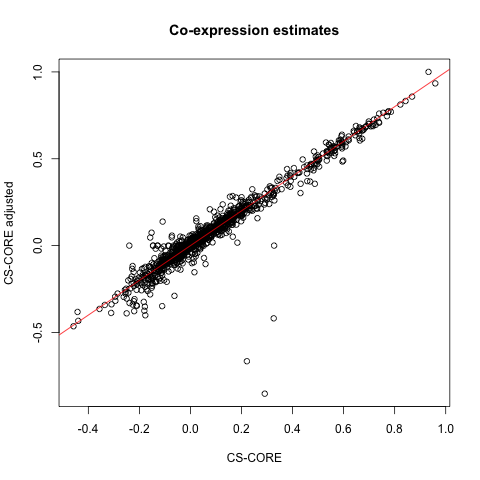

# Covariate adjustment

## Motivation

The original implementation of CS-CORE does not consider covariate
adjustment. For example, in the
[paper](https://www.nature.com/articles/s41467-023-40503-7), we assumed

\\ {\bf z\_{i}}\sim F_p({\bf \mu}, \Sigma), x\_{ij}\|z\_{ij} \sim
\text{Poisson}(s_i z\_{ij}) \\

such that the mean \\{\bf \mu}\\ and the variance-covariance matrix
\\\Sigma\\ of underlying gene expression are exactly the same for all
cells in the population. However, in real data, it is possible that the
mean, variance, and co-expression of underlying gene expression could be
affected by technical covariates (such as percent.mt) or biological
covariates (such as sex) that vary across cell.

## New moment-based regressions for covariate adjustment

In June 2025, we added a new feature to CS-CORE that allows adjusting
for covariates in co-expression inference. In particular, we adjust for
covariates through modelling \\{\bf mu}\\ and \\\Sigma\\ as a function
of covariates \\c\_{ik}\\’s: \\ {\bf \mu}\_{i}={\bf \mu}+\sum_k c\_{ik}
{\bf \beta_k}, \\ \Sigma\_{i}=\Sigma +\sum_k c\_{ik} {\bf \gamma_k} \\
This leads to the following moment-based regression:

\\ x\_{ij} = s_i (\mu_j + \sum_k c\_{ik} \beta_k) + \epsilon\_{ij} \\

\\(x\_{ij} - s_i \mu\_{ij})^2 = s_i \mu\_{ij} + s_i^2 (\sigma\_{jj} +
\sum_k c\_{ik} \gamma_k) + \eta\_{ij}\\ \\(x\_{ij} - s_i
\mu\_{ij})(x\_{ij'} - s_i \mu\_{ij'}) = s_i^2 (\sigma\_{jj'} + \sum_k
c\_{ik} \theta_k) + \xi\_{ijj'},\\

where \\\mu\_{ij} = \mu_j + \sum_k c\_{ik} \beta_k\\. These allow
adjusting for \\K\\ covariates \\c\_{ik}\\’s for their effects on the
underlying gene expression mean (\\\beta_k\\’s), variance
(\\\gamma_k\\’s) and covariance (\\\theta_k\\’s).

## Demonstration on real data

Here, we demonstrates how to adjust for covariates in CS-CORE with the
same dataset as in [Getting
started](https://changsubiostats.github.io/CS-CORE/articles/CSCORE.md).

``` r
library(CSCORE)
library(Seurat)
```

``` r
# wget https://hosted-matrices-prod.s3-us-west-2.amazonaws.com/Single_cell_atlas_of_peripheral_immune_response_to_SARS_CoV_2_infection-25/blish_covid.seu.rds

pbmc <- readRDS('blish_covid.seu.rds')
pbmc <- UpdateSeuratObject(pbmc) # update the obsolete Seurat object
pbmc_B = pbmc[,pbmc$cell.type.coarse %in% 'B']
mean_exp = rowMeans(pbmc_B@assays$RNA@counts/pbmc_B$nCount_RNA)
genes_selected = names(sort.int(mean_exp, decreasing = T))[1:200]
pbmc_B_healthy <- pbmc_B[, pbmc_B$Status == "Healthy"]
```

This dataset comes with detailed cell-level covariates:

``` r
colnames(pbmc_B_healthy@meta.data)
#>  [1] "orig.ident"       "nCount_RNA"       "nFeature_RNA"     "percent.mt"       "percent.rps"      "percent.rpl"     
#>  [7] "percent.rrna"     "nCount_SCT"       "nFeature_SCT"     "SCT_snn_res.1"    "seurat_clusters"  "singler"         
#> [13] "Admission.level"  "cell.type.fine"   "cell.type.coarse" "cell.type"        "IFN1"             "HLA1"            
#> [19] "Donor.orig"       "Donor.full"       "Donor"            "Status"           "Sex"              "DPS"             
#> [25] "DTF"              "Admission"        "Ventilated"
```

As an example, we choose to adjust for `Sex` and `percent.mt`. To run
CS-CORE with covariate adjustment, use

``` r
CSCORE_result_adj <- CSCORE(pbmc_B_healthy,
                            genes = genes_selected,
                            covariate_names = c('percent.mt', 'Sex'))
#> [INFO] Adjust for covariates: percent.mt, Sex 
#> [INFO] Variables in the design matrix: percent.mt, SexM 
#> [INFO] IRLS converged after 3 iterations.
#> [INFO] Starting WLS for covariance at Thu Jun 26 17:09:48 2025
#> [INFO] 1 among 200 genes have invalid variance estimates. Their co-expressions with other genes were set to 0.
#> [INFO] 0.0854% co-expression estimates were greater than 1 and were set to 1.
#> [INFO] 0.0101% co-expression estimates were smaller than -1 and were set to -1.
#> [INFO] Finished WLS. Elapsed time: 1.8762 seconds.
```

By default, `CSCORE` extracts the covariates from the Seurat object and
construct a design matrix with scaled and centered covariates. To
understand the detailed impact of covariate adjustment, we also compare
with the results without covariate adjustment.

``` r
CSCORE_result <- CSCORE(pbmc_B_healthy, genes = genes_selected)
#> [INFO] IRLS converged after 3 iterations.
#> [INFO] Starting WLS for covariance at Thu Jun 26 17:09:50 2025
#> [INFO] 0.0101% co-expression estimates were greater than 1 and were set to 1.
#> [INFO] 0.0000% co-expression estimates were smaller than -1 and were set to -1.
#> [INFO] Finished WLS. Elapsed time: 1.2249 seconds.
```

``` r
# compare co-expression estimates for a random set of gene pairs
set.seed(42002)
p <- length(genes_selected)
random_pairs <- sample(which(upper.tri(matrix(1:p^2, p, p))), 1000)
plot(CSCORE_result$est[random_pairs],
     CSCORE_result_adj$est[random_pairs],
     xlab = 'CS-CORE', ylab = 'CS-CORE adjusted',
     main = 'Co-expression estimates')
abline(0,1,col='red')
```



``` r
plot(CSCORE_result$test_stat[random_pairs],
     CSCORE_result_adj$test_stat[random_pairs],
     xlab = 'CS-CORE', ylab = 'CS-CORE adjusted',
     main = 'Test_stat')
abline(0,1,col='red')
```


It seems that the co-expression for most gene pairs are similar with and
without covariate adjustment. We recommend users to sanity check this
and examine the impact of covariate adjustment on co-expression
inference.

## Advanced topics

The application above adjusts for covariates in the underlying
expression levels’ mean, variance, and covariance. For users who wish to
have more fine-grained control on the regression models, we provide two
additional parameters: `adjust_setting` and `covariate_level`.

### `adjust_setting`

We provide these two options in
[CSCORE_IRLS_cpp](https://changsubiostats.github.io/CS-CORE/articles/CSCORE_IRLS_cpp.md),
which is the function underlying `CSCORE`. `adjust_setting` allows you
to choose which regression model to adjust covariates for. For example,
if `adjust_setting=c(mean = T, var = F, covar = T)`, this is equivalent
to running the following regressions:

\\ x\_{ij} = s_i (\mu_j + \sum_k c\_{ik} \beta_k) + \epsilon\_{ij} \\

\\ (x\_{ij} - s_i \mu\_{ij})^2 = s_i \mu\_{ij} + s_i^2 \sigma\_{jj} +
\eta\_{ij} \\

\\ (x\_{ij} - s_i \mu\_{ij})(x\_{ij'} - s_i \mu\_{ij'}) = s_i^2
(\sigma\_{jj'} + \sum_k c\_{ik} \theta_k) + \xi\_{ijj'}, \\

### `covariate_level`

In the adjustment models above, we assume \\{\bf z\_{i}}\sim F_p({\bf
\mu}, \Sigma), x\_{ij}\|z\_{ij} \sim \text{Poisson}(s_i z\_{ij})\\ and
\\{\bf \mu}\_{i}={\bf \mu}+\sum_k c\_{ik} {\bf \beta_k}\\. This implies
that the underlying mean expression is associated with covariates.

Another possible model is to assume \\\text{Poisson}(s_i z\_{ij} +
\sum_k c\_{ik} {\bf \beta_k})\\, which implies that the covariates
operate in the measurement process, independent of underlying gene
expression. Even though we think the default model is more natural, we
allow for this flexibility by specifying `covariate_level = "x"`. This
will run \\ x\_{ij} = s_i \mu_j + \sum_k c\_{ik} \beta_k +
\epsilon\_{ij}, \\ and similarly for variance and covariance.
